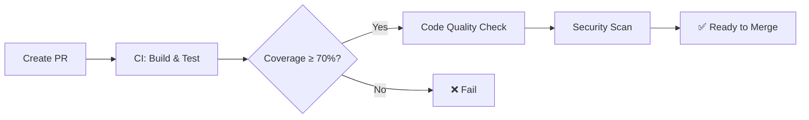
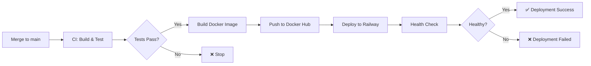

# ✅ Bước 2.1: GitHub Actions Workflow - HOÀN THÀNH

## 📦 Files Created

```
volunteer/
├── .github/
│   ├── workflows/
│   │   └── ci-cd.yml              # Main CI/CD pipeline
│   ├── CI_CD_GUIDE.md             # Hướng dẫn chi tiết pipeline
│   ├── SETUP_SECRETS.md           # Hướng dẫn setup secrets
│   └── README_CICD.md             # File này
├── Dockerfile                     # Multi-stage Docker build
├── .dockerignore                  # Docker build optimization
├── docker-compose.yml             # Local development setup
└── railway.json                   # Railway deployment config
```

---

## 🎯 Pipeline Features

### ✅ CI Pipeline (Continuous Integration)

**Chạy trên**: Push/PR to `main` or `develop`

| Feature | Implementation | Status |
|---------|---------------|--------|
| Build với Maven | `./mvnw clean compile` | ✅ |
| Chạy tests | `./mvnw test` | ✅ |
| JaCoCo coverage | `./mvnw jacoco:report` | ✅ |
| Coverage threshold | Fail if < 70% | ✅ |
| Upload coverage | Codecov integration | ✅ |
| PR comments | Coverage details on PR | ✅ |
| Test artifacts | Surefire reports archived | ✅ |
| Code quality | SpotBugs + Checkstyle | ✅ |
| Security scan | Trivy vulnerability scanner | ✅ |

### ✅ CD Pipeline (Continuous Deployment)

**Chạy trên**: Push to `main` only

| Feature | Implementation | Status |
|---------|---------------|--------|
| Docker build | Multi-stage optimized | ✅ |
| Docker push | To Docker Hub | ✅ |
| Image tags | latest, sha, branch | ✅ |
| Image scan | Trivy security scan | ✅ |
| Railway deploy | CLI deployment | ✅ |
| Health check | Auto verification | ✅ |
| Notifications | Slack (optional) | ✅ |

---

## 📋 Setup Checklist

### 1. GitHub Secrets (Bắt buộc)

Vào **Settings** → **Secrets and variables** → **Actions** → **New secret**

- [ ] `DOCKER_USERNAME` - Docker Hub username
- [ ] `DOCKER_PASSWORD` - Docker Hub access token
- [ ] `RAILWAY_TOKEN` - Railway API token

### 2. GitHub Environment (Cho deployment verification)

Vào **Settings** → **Environments** → **New environment** → `production`

- [ ] `RAILWAY_APP_URL` - URL của app trên Railway

### 3. Optional Secrets

- [ ] `CODECOV_TOKEN` - Codecov upload token
- [ ] `SLACK_WEBHOOK_URL` - Slack webhook for notifications

**Chi tiết**: Xem file `.github/SETUP_SECRETS.md`

---

## 🚀 Quick Start

### Test CI Pipeline

```bash
# 1. Tạo branch mới
git checkout -b test-ci

# 2. Commit thay đổi (hoặc empty commit)
git commit --allow-empty -m "Test CI pipeline"

# 3. Push và xem kết quả
git push origin test-ci
```

→ Xem progress tại: `https://github.com/YOUR_USERNAME/volunteer/actions`

### Test Full CI/CD

```bash
# 1. Merge vào main (sau khi CI pass)
git checkout main
git merge test-ci

# 2. Push to trigger deployment
git push origin main
```

→ Pipeline sẽ chạy: CI → Build Docker → Deploy Railway

---

## 📊 Pipeline Workflow

### Pull Request Flow



### Main Branch Flow



---

## 🐳 Docker Details

### Image Structure

```dockerfile
# Stage 1: Build (Maven + JDK 21)
FROM maven:3.9.9-eclipse-temurin-21-alpine AS build
# ... build application

# Stage 2: Runtime (JRE 21 only)
FROM eclipse-temurin:21-jre-alpine
# ... minimal runtime
```

**Benefits**:
- ✅ Small size: ~300MB (vs ~800MB full JDK)
- ✅ Fast builds: Layer caching
- ✅ Secure: Non-root user
- ✅ Production-ready: Health checks

### Local Testing

```bash
# Build image
docker build -t volunteer-app .

# Run container
docker run -p 8080:8080 \
  -e SPRING_PROFILES_ACTIVE=dev \
  -e SPRING_DATASOURCE_URL=jdbc:postgresql://host.docker.internal:5432/volunteer \
  volunteer-app

# Or use docker-compose
docker-compose up
```

---

## 🌐 Railway Deployment

### First-Time Setup

1. **Install Railway CLI**:
   ```bash
   npm install -g @railway/cli
   railway login
   ```

2. **Create Project**:
   ```bash
   railway init
   # Chọn: volunteer-backend
   ```

3. **Link Repository**:
   - Vào Railway dashboard
   - Connect GitHub repository
   - Chọn branch `main`

4. **Add PostgreSQL**:
   ```bash
   railway add
   # Chọn: PostgreSQL
   ```

5. **Set Environment Variables**:
   - Copy từ `.env.example`
   - Paste vào Railway dashboard → Variables

### Deployment Process

**Automatic** (từ GitHub Actions):
```bash
# Khi merge vào main, pipeline tự động:
1. Build Docker image
2. Push to Docker Hub
3. railway up --service volunteer-backend
4. Verify deployment health
```

**Manual** (nếu cần):
```bash
railway up
railway logs
railway status
```

---

## 📈 Coverage Tracking

### Local Report

```bash
# Generate coverage
./mvnw clean test jacoco:report

# Open report
start target/site/jacoco/index.html  # Windows
open target/site/jacoco/index.html   # macOS
xdg-open target/site/jacoco/index.html  # Linux
```

### Codecov Integration

1. **Sign up**: [codecov.io](https://codecov.io)
2. **Add repository**: Connect GitHub
3. **Get token**: Settings → Copy token
4. **Add to GitHub**: Secrets → `CODECOV_TOKEN`

**Coverage badge**:
```markdown
[](https://codecov.io/gh/USERNAME/volunteer)
```

---

## 🔧 Troubleshooting

### ❌ "Docker login failed"

**Cause**: Invalid Docker Hub credentials

**Fix**:
```bash
# 1. Generate new access token
# Docker Hub → Account Settings → Security → New Access Token

# 2. Update GitHub secret
# Settings → Secrets → DOCKER_PASSWORD → Update
```

### ❌ "Railway deployment failed"

**Cause**: Invalid Railway token hoặc missing env vars

**Fix**:
```bash
# 1. Get new token
railway login
railway whoami

# 2. Update GitHub secret
# Settings → Secrets → RAILWAY_TOKEN

# 3. Check Railway logs
railway logs --service volunteer-backend
```

### ❌ "Coverage check failed"

**Cause**: Coverage < 70%

**Fix**:
```bash
# 1. Check coverage locally
./mvnw jacoco:report
open target/site/jacoco/index.html

# 2. Write more tests for uncovered code
# 3. Run tests again
./mvnw test

# 4. Verify threshold met
./mvnw jacoco:check
```

### ❌ "Tests failed in CI but pass locally"

**Cause**: Environment differences

**Fix**:
```bash
# 1. Check Java version
java -version  # Should be 21

# 2. Clean Maven cache
./mvnw clean

# 3. Run exact CI command
./mvnw clean test -B

# 4. Check for flaky tests
./mvnw test -Dtest=FlakyTestName
```

---

## 📊 Performance Metrics

### Expected Pipeline Times

| Stage | First Run | Cached Run |
|-------|-----------|------------|
| Checkout & Setup | 30s | 20s |
| Maven Build | 2-3 min | 1 min |
| Tests (178 tests) | 40-50s | 40-50s |
| Coverage Report | 10s | 10s |
| Docker Build | 3-4 min | 1-2 min |
| Docker Push | 1 min | 30s |
| Railway Deploy | 2-3 min | 2-3 min |
| **Total CI** | **~4-5 min** | **~2-3 min** |
| **Total CI/CD** | **~10-12 min** | **~6-8 min** |

### Optimization Tips

**Maven**:
```xml
<!-- Use parallel builds -->
<properties>
  <maven.compiler.threads>4</maven.compiler.threads>
</properties>
```

**Docker**:
```dockerfile
# Cache dependencies layer
COPY pom.xml .
RUN mvn dependency:go-offline

# Cache reduces build from 4 min → 1 min
```

**GitHub Actions**:
```yaml
# Cache Maven packages
- uses: actions/cache@v4
  with:
    path: ~/.m2/repository
```

---

## 🎯 Next Steps

### Immediate (Bắt buộc)

- [x] ✅ Tạo GitHub Actions workflow
- [x] ✅ Tạo Dockerfile
- [x] ✅ Tạo docker-compose.yml
- [ ] ⏳ Setup GitHub Secrets
- [ ] ⏳ Setup Railway project
- [ ] ⏳ Test pipeline

### Short-term (Khuyến nghị)

- [ ] Add Codecov integration
- [ ] Setup Slack notifications
- [ ] Add badges to README
- [ ] Document deployment process

### Long-term (Tùy chọn)

- [ ] Add staging environment
- [ ] Setup automated backups
- [ ] Add monitoring (Sentry/Datadog)
- [ ] Implement blue-green deployment

---

## 📚 Documentation

| File | Purpose |
|------|---------|
| `ci-cd.yml` | Main pipeline configuration |
| `CI_CD_GUIDE.md` | Detailed pipeline documentation |
| `SETUP_SECRETS.md` | Secrets setup instructions |
| `Dockerfile` | Production Docker image |
| `docker-compose.yml` | Local development environment |
| `railway.json` | Railway deployment config |

---

## ✅ Verification

Sau khi setup, verify rằng:

- [ ] Pipeline chạy thành công trên PR
- [ ] Coverage report được generate
- [ ] Docker image được build và push
- [ ] App được deploy lên Railway
- [ ] Health check pass
- [ ] App accessible qua Railway URL

**Test command**:
```bash
curl https://your-app.up.railway.app/actuator/health
# Response: {"status":"UP"}
```

---

## 🎉 Success Criteria

Pipeline được coi là thành công khi:

✅ All tests pass (178/178)
✅ Coverage ≥ 70%
✅ Docker image built & tagged
✅ Pushed to Docker Hub
✅ Deployed to Railway
✅ Health check returns 200 OK
✅ No security vulnerabilities (CRITICAL/HIGH)

---

**Need help?** Check:
- 📖 CI_CD_GUIDE.md - Detailed pipeline docs
- 🔐 SETUP_SECRETS.md - Secrets configuration
- 🐛 GitHub Issues - Report problems
- 💬 Pull Request comments - Coverage details
